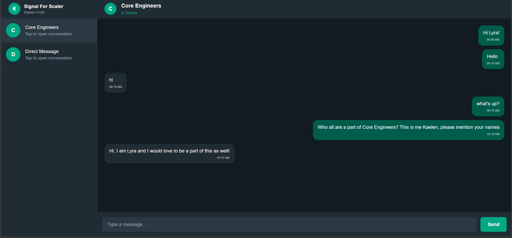
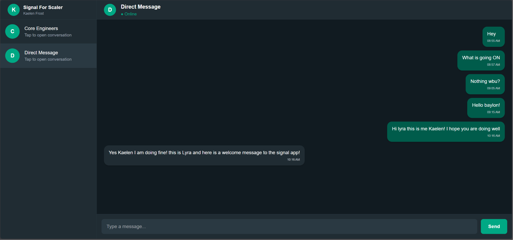
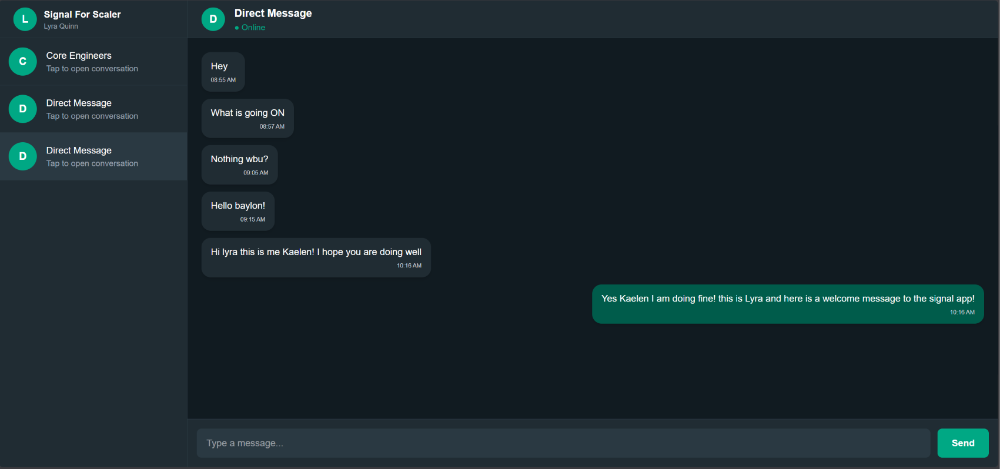

# Signal Clone

A full-stack real-time messaging application inspired by Signal, built with **FastAPI**, **Next.js**, **WebSockets**, and **SQLite**.

##  Live Demo

### Frontend (Vercel)
https://scaler-signal-clone-nu.vercel.app

### Backend API (Render)
https://scaler-signal-clone-ashrith.onrender.com

> **Note:** The backend is hosted on Render's free tier and may take 30–60 seconds to wake up after a period of inactivity.

---

#  Features

-  OTP-based authentication flow
-  Direct and Group Conversations
-  Real-time messaging using WebSockets
-  Persistent chat history
-  FastAPI REST APIs
-  SQLite database with SQLAlchemy ORM
- Responsive Next.js + Tailwind CSS frontend
-  Deployed on Render and Vercel

---

#  Tech Stack

### Backend
- FastAPI
- SQLAlchemy
- SQLite
- Uvicorn
- WebSockets

### Frontend
- Next.js 15
- React
- TypeScript
- Tailwind CSS
- Axios

### Deployment
- Render (Backend)
- Vercel (Frontend)

---

#  Demo Users

The frontend supports switching between demo users using URL parameters.

### Kaelen Frost

```
https://scaler-signal-clone-nu.vercel.app/?user=kaelen
```

### Lyra Quinn

```
https://scaler-signal-clone-nu.vercel.app/?user=lyra
```

Open both URLs in different browser windows (or one in Incognito) to simulate two users chatting in real time.

---

#  Project Structure

```
scaler-signal-clone/
│
├── backend/
│   ├── app/
│   ├── websocket/
│   ├── services/
│   ├── schemas/
│   ├── models/
│   └── seed.py
│
├── frontend/
│   ├── src/
│   ├── components/
│   ├── lib/
│   ├── hooks/
│   └── types/
│
└── README.md
```

---

# ⚙️ Local Setup

## Clone Repository

```bash
git clone https://github.com/AshrithRedx/scaler-signal-clone.git
cd scaler-signal-clone
```

---

## Backend

```bash
cd backend

python -m venv venv

# Windows
venv\Scripts\activate

# Linux / macOS
source venv/bin/activate

pip install -r requirements.txt

python seed.py

uvicorn app.main:app --reload
```

Backend runs at

```
http://127.0.0.1:8000
```

---

## Frontend

```bash
cd frontend

npm install

npm run dev
```

Frontend runs at

```
http://localhost:3000
```

---

# 📡 API Endpoints

| Method | Endpoint | Description |
|---------|----------|-------------|
| POST | `/auth/login` | Login |
| POST | `/auth/verify-otp` | Verify OTP |
| GET | `/users` | Get users |
| GET | `/conversations` | Get conversations |
| GET | `/messages/{conversationId}` | Fetch messages |
| WS | `/ws/{conversationId}` | Real-time messaging |

---

# 📷 Screenshots

## Groups



---

## Person 1 POV



---

## Person 2 POV



---

#  Author

**Ashrith Reddy Kondakalla**

GitHub:
https://github.com/AshrithRedx

---

# 📄 License

This project was developed as part of a technical assessment.
